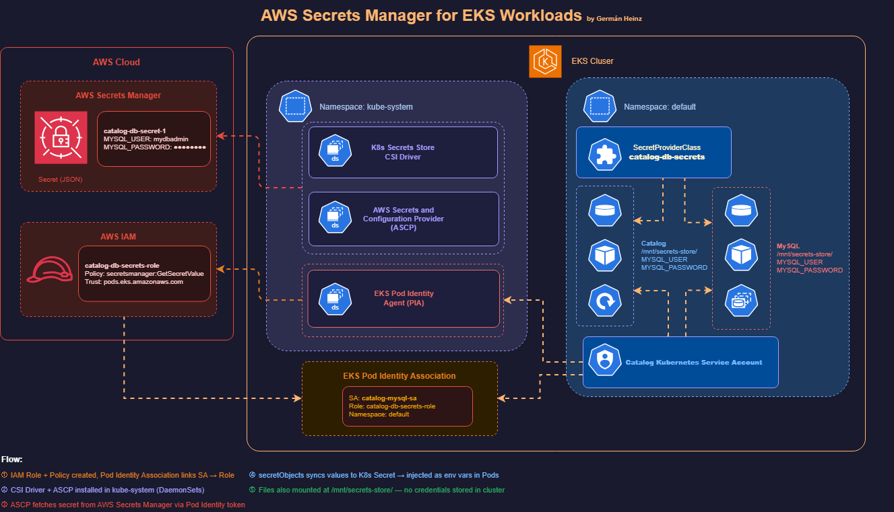

In this section, we’ll install the **Secrets Store CSI Driver** and the **AWS Secrets and Configuration Provider (ASCP)** on our EKS cluster.
This setup enables Kubernetes Pods to securely retrieve secrets from **AWS Secrets Manager** and **AWS Systems Manager Parameter Store**,
using **EKS Pod Identity** for authentication without storing any credentials inside the cluster.

---

## **Learning Objectives**

By the end of this lesson, you will:

* Understand how the **Secrets Store CSI Driver** works inside EKS.
* Install both the **CSI Driver** and the **AWS Secrets Provider (ASCP)**.
* Verify that both components are running as **DaemonSets** in the `kube-system` namespace.
* Prepare your cluster for mounting AWS Secrets directly into Pods (used in the next section 09-04).

---

## Architecture Overview



```
+------------------------------------+
| AWS Secrets Manager                |
| Secret: catalog-db-secret          |
| {                                  |
|   "MYSQL_USER":"catalog",          |
|   "MYSQL_PASSWORD":"MyS3cr3tPwd"   |
| }                                  |
+----------------+-------------------+
                 |
                 | (via EKS Pod Identity)
                 v
+-------------------------------------------+
| Amazon EKS Cluster                        |
|  - Pod Identity Agent                     |
|  - k8s CSI Driver and ASCP                |
|  - catalog-mysql-sa (ServiceAccount)      |
|  - SecretProviderClass: catalog-db-secrets|
|                                           |
|  /mnt/secrets-store/MYSQL_USER            |
|  /mnt/secrets-store/MYSQL_PASSWORD        |
+-------------------------------------------+
```

---

## **Step-01: Verify Prerequisites**

Before installing ASCP, confirm the following:

✅ EKS Cluster version **1.24 or later** (required for Pod Identity)
✅ You are using **EC2 node groups** (Fargate not supported)
✅ **Helm v3+** and **kubectl** are installed locally
✅ **EKS Pod Identity Agent add-on** is already installed
✅ You are connected to the cluster:

```bash
kubectl get nodes
```

---

## **Step-02: Install Helm CLI and Add Helm Repositories**

---
### Step-02-01: Install Helm CLI
- [Helm CLI Install](https://helm.sh/docs/intro/install/)
```bash
# Install Helm CLI
brew install helm

# Get helm version
helm version
```
### Step-02-02: Add Helm Repositories
Add both the Kubernetes CSI Driver and AWS Secrets Provider repositories.
```bash
# Add Helm Repositories
helm repo add secrets-store-csi-driver https://kubernetes-sigs.github.io/secrets-store-csi-driver/charts
helm repo add aws-secrets-manager https://aws.github.io/secrets-store-csi-driver-provider-aws
helm repo update

# List Helm Repos
helm repo list
```

Expected:

```
NAME                    URL
secrets-store-csi-driver https://kubernetes-sigs.github.io/secrets-store-csi-driver/charts
aws-secrets-manager      https://aws.github.io/secrets-store-csi-driver-provider-aws
```

---

## **Step-03: Install the Secrets Store CSI Driver**

Install the core driver that enables Kubernetes to mount external secrets.

> ⚠️ **Required for EKS Pod Identity:** The `--set tokenRequests[0].audience=""` flag enables token-based authentication needed by the CSI driver to work with Pod Identity. Without it, pods will fail to mount secrets with the error: `CSI token error: serviceAccount.tokens not provided`.

```bash
# Install the Secrets Store CSI Driver in the kube-system namespace:
helm install csi-secrets-store secrets-store-csi-driver/secrets-store-csi-driver \
  --namespace kube-system \
  --set tokenRequests[0].audience=""

# If already installed without this flag, upgrade instead:
# helm upgrade csi-secrets-store secrets-store-csi-driver/secrets-store-csi-driver \
#   --namespace kube-system \
#   --set tokenRequests[0].audience=""

# List all Helm releases across namespaces:
helm list --all-namespaces

# List releases only in the kube-system namespace:
helm list -n kube-system

# Verify installation status, pods, and resources created by the release:
helm status csi-secrets-store -n kube-system


# Verify pods:
kubectl get pods -n kube-system -l app=secrets-store-csi-driver
```

✅ Example:

```
NAME                                               READY   STATUS    RESTARTS   AGE
csi-secrets-store-secrets-store-csi-driver-gvdnm   3/3     Running   0          30s
csi-secrets-store-secrets-store-csi-driver-lzqnf   3/3     Running   0          30s
csi-secrets-store-secrets-store-csi-driver-rhjwv   3/3     Running   0          30s
```

At this point, the **CSI driver** is installed and working.

---

## **Step-04: Install the AWS Secrets and Configuration Provider (ASCP)**

Next, install the AWS-specific provider that connects the CSI driver to AWS Secrets Manager and Parameter Store.

This component is called **AWS Secrets and Configuration Provider (ASCP).**

### Why `--set secrets-store-csi-driver.install=false`?

The AWS Provider Helm chart includes the CSI driver as a dependency by default.
Since we already installed it in Step-03, we must disable that dependency to prevent Helm ownership conflicts.

---

### Step-04-01: Install the AWS Provider

```bash
# Install the AWS Secrets Manager CSI Driver Provider in the kube-system namespace.
helm install secrets-provider-aws aws-secrets-manager/secrets-store-csi-driver-provider-aws --namespace kube-system --set secrets-store-csi-driver.install=false

# List installed Helm Releases
helm list -n kube-system

# Inspect the AWS provider Helm release:
helm status secrets-provider-aws -n kube-system
```

✅ This command installs only the **AWS provider (ASCP)** components and reuses the CSI driver already installed.

---

### Step-04-02: Optional Flags

| Flag                                                            | Purpose                                 |
| --------------------------------------------------------------- | --------------------------------------- |
| `--set useFipsEndpoint=true`                                    | Use AWS FIPS endpoint (for compliance). |
| `--set-json 'k8sThrottlingParams={"qps": "20", "burst": "40"}'` | Tune API rate limits.                   |
| `--set podIdentityHttpTimeout=500ms`                            | Adjust Pod Identity connection timeout. |

---

### Step-04-03: Verify Installation

After ~30 seconds, check that all pods are running:

```bash
# CSI driver pods
kubectl get pods -n kube-system -l app=secrets-store-csi-driver

# AWS provider (ASCP) pods
kubectl get pods -n kube-system -l app=secrets-store-csi-driver-provider-aws
```

✅ Example output:

```
NAME                                               READY   STATUS    RESTARTS   AGE
csi-secrets-store-secrets-store-csi-driver-gvdnm   3/3     Running   0          1m
csi-secrets-store-secrets-store-csi-driver-lzqnf   3/3     Running   0          1m
csi-secrets-store-secrets-store-csi-driver-rhjwv   3/3     Running   0          1m

NAME                                                                  READY   STATUS    RESTARTS   AGE
secrets-provider-aws-secrets-store-csi-driver-provider-awsjjlgq       1/1     Running   0          1m
secrets-provider-aws-secrets-store-csi-driver-provider-awsmg5m6       1/1     Running   0          1m
secrets-provider-aws-secrets-store-csi-driver-provider-awstdhf8       1/1     Running   0          1m
```

---

### Step-04-04: Verify DaemonSets

```bash
kubectl get daemonset -n kube-system | grep secrets-store
```

Expected:

```
csi-secrets-store-secrets-store-csi-driver
secrets-provider-aws-secrets-store-csi-driver-provider-aws
```

---

### Step-04-05: Troubleshooting

If you don’t see the AWS provider pods (`csi-secrets-store-provider-aws`):

```bash
kubectl describe daemonset secrets-provider-aws-secrets-store-csi-driver-provider-aws -n kube-system
kubectl logs -n kube-system -l app=secrets-store-csi-driver-provider-aws
```

**Pod stuck in `ContainerCreating` with error `CSI token error: serviceAccount.tokens not provided`:**

This means the CSI driver was installed without `tokenRequests`. Fix with:

```bash
# Upgrade the CSI driver to enable token requests (required for Pod Identity)
helm upgrade csi-secrets-store secrets-store-csi-driver/secrets-store-csi-driver \
  --namespace kube-system \
  --set tokenRequests[0].audience=""

# Verify the CSIDriver now has tokenRequests
kubectl get csidriver secrets-store.csi.k8s.io -o jsonpath=’{.spec.tokenRequests}’

# Delete the stuck pod so it remounts
kubectl delete pod <pod-name>
```

---

### Step-04-06: **Optional: List All Resources Created by the AWS Provider**

You can inspect all the resources managed by the Helm release:

```bash
kubectl get all,sa,cm,ds,deploy,pod -n kube-system -l "app.kubernetes.io/instance=secrets-provider-aws"
```

✅ Example output:

```
NAME                                                                  READY   STATUS    RESTARTS   AGE
pod/secrets-provider-aws-secrets-store-csi-driver-provider-awsjjlgq   1/1     Running   0          2m
pod/secrets-provider-aws-secrets-store-csi-driver-provider-awsmg5m6   1/1     Running   0          2m
pod/secrets-provider-aws-secrets-store-csi-driver-provider-awstdhf8   1/1     Running   0          2m

NAME                                                                        DESIRED   CURRENT   READY   AGE
daemonset.apps/secrets-provider-aws-secrets-store-csi-driver-provider-aws   3         3         3       2m

NAME                                                                        SECRETS   AGE
serviceaccount/secrets-provider-aws-secrets-store-csi-driver-provider-aws   0         2m
```

---

### Step-04-07: **Summary**

| Component                                  | Installed By                                                                     | Namespace   | Purpose                                                      | Status      |
| ------------------------------------------ | -------------------------------------------------------------------------------- | ----------- | ------------------------------------------------------------ | ----------- |
| **Secrets Store CSI Driver**               | `helm install csi-secrets-store`                                                 | kube-system | Mounts external secrets into Pods                            | ✅ Running   |
| **AWS Secrets and Config Provider (ASCP)** | `helm install secrets-provider-aws --set secrets-store-csi-driver.install=false` | kube-system | Connects CSI Driver to AWS Secrets Manager / Parameter Store | ✅ Running   |
| **EKS Pod Identity Agent**                 | `eksctl create addon --name eks-pod-identity-agent`                              | kube-system | Handles IAM authentication for Pods                          | ✅ Installed |

---

## Step-05: Create IAM Role, Policy and EKS Pod Identity Association
Now that the drivers are installed, let’s create IAM resources so Pods can securely assume an AWS role via Pod Identity.

### Step-05-01: Create IAM Policy and Role for Pod Identity (AWS Secrets Manager Access)

In this step, we’ll create a fine-grained **IAM role** and **IAM policy** that allow the **MySQL Pod** inside our EKS cluster to securely access credentials from **AWS Secrets Manager**, using **EKS Pod Identity** for authentication.

---

### Step-05-02: **Learning Objectives**

By the end of this step, you will:

* Export and verify key AWS environment variables.
* Create an IAM policy allowing Pods to read a specific AWS secret.
* Create an IAM role trusted by the **EKS Pod Identity Agent**.
* Attach the policy to the role.
* Associate that IAM role with the **Kubernetes ServiceAccount** (`catalog-mysql-sa`).
* Verify the Pod Identity association.

---

### **Step-05-03: Export Environment Variables**

Before running any commands, export these values so everything works dynamically without edits later.

```bash
# Replace the placeholders below with your actual values
export AWS_REGION="us-east-1"
export EKS_CLUSTER_NAME="retail-dev-eksdemo1"
export AWS_ACCOUNT_ID=$(aws sts get-caller-identity --query Account --output text)

# Confirm values
echo $AWS_REGION
echo $EKS_CLUSTER_NAME
echo $AWS_ACCOUNT_ID
```
---

### **Step-05-04: Create IAM Policy**

This policy grants permission to read one secret — `catalog-db-secret` — from AWS Secrets Manager.

**VERY VERY IMPORTANT NOTE:** We’re scoping access to only one secret (catalog-db-secret*) — least-privilege best practice.
  # Asegúrate de estar en la carpeta policies                                                                                                                       
  # cd k8s/catalog/policies

  # 1. Crear la IAM Policy
  aws iam create-policy --policy-name catalog-db-secret-policy --policy-document file://catalog-db-secret-policy.json

  # 2. Crear el IAM Role con trust policy
  aws iam create-role --role-name catalog-db-secrets-role --assume-role-policy-document file://trust-policy.json

  # 3. Attachar la policy al role
  aws iam attach-role-policy --role-name catalog-db-secrets-role --policy-arn arn:aws:iam::226363864573:policy/catalog-db-secret-policy

  # 4. Verificar
  aws iam list-attached-role-policies --role-name catalog-db-secrets-role

  # Las variables ${AWS_REGION} y ${AWS_ACCOUNT_ID} ya están hardcodeadas en el JSON (us-east-1 / 226363864573), así que no necesitas exportarlas.


✅ Output should show:

```json
{
    "AttachedPolicies": [
        {
            "PolicyName": "catalog-db-secret-policy",
            "PolicyArn": "arn:aws:iam::180789647333:policy/catalog-db-secret-policy"
        }
    ]
}
```

---

### **Step-05-06: Create Pod Identity Association**

- Now we’ll associate this IAM role with the Kubernetes ServiceAccount `catalog-mysql-sa`
so the MySQL StatefulSet can access the secret.
- It’s not an issue if the ServiceAccount doesn’t exist yet — it will be created later with the same name when deploying the StatefulSet.

```bash
# Verify Amazon EKS Pod Identity Agent Installation
aws eks list-addons --cluster-name ${EKS_CLUSTER_NAME}

## Sample Output
{
    "addons": [
        "eks-pod-identity-agent"
    ]
}

# Create Pod Identity Association
aws eks create-pod-identity-association --cluster-name ${EKS_CLUSTER_NAME} --namespace default --service-account catalog-mysql-sa --role-arn arn:aws:iam::${AWS_ACCOUNT_ID}:role/catalog-db-secrets-role
```

---

### **Step-05-07: Verify Pod Identity Association**

List all associations in your cluster:

```bash
# List Pod Identity Associations
aws eks list-pod-identity-associations --cluster-name ${EKS_CLUSTER_NAME}
```


---

### **Step-05-08: Verify in Kubernetes (Optional)**
- Check that your Kubernetes ServiceAccount exists and is ready for binding:

```bash
kubectl get sa catalog-mysql-sa
```

- Note: It’s perfectly fine if this ServiceAccount is not created yet 
it will be created automatically later in next section **09-04** when we deploy the Kubernetes manifests for the Catalog MySQL component.

---

### ✅ Step-05-09: **Summary**

| Resource                     | Purpose                                             | Created Using                             | Verified |
| ---------------------------- | --------------------------------------------------- | ----------------------------------------- | -------- |
| **IAM Policy**               | Allows reading specific secret from Secrets Manager | `aws iam create-policy`                   | ✅        |
| **IAM Role**                 | Trusted by EKS Pod Identity                         | `aws iam create-role`                     | ✅        |
| **Policy Attachment**        | Grants access to Secrets Manager                    | `aws iam attach-role-policy`              | ✅        |
| **Pod Identity Association** | Binds IAM role to ServiceAccount                    | `aws eks create-pod-identity-association` | ✅        |

---

## What Next?
[**Next:** Integrate AWS Secrets Manager with the Catalog microservice in **Section 09-04**](../09_04_AWS_Secrets_Manager_Catalog_Integration/)

-- 


## Additional Reference
- [secrets-store-csi-driver-provider-aws](https://github.com/aws/secrets-store-csi-driver-provider-aws)


---------------------------------------


# Integrate AWS Secrets Manager with Catalog Microservice (EKS Pod Identity)

In this section, we’ll securely connect **AWS Secrets Manager** with our Kubernetes Pods
to provide MySQL credentials **without ever storing them inside Kubernetes Secrets**.
This is the **production-grade, zero-trust setup** — credentials live only in AWS,
and are fetched dynamically inside the container via the **AWS Secrets and Configuration Provider (ASCP)**.

---  

## **Learning Objectives**

By the end of this step, you will:

* Create an **AWS Secrets Manager secret** (`catalog-db-secret-1`) with MySQL credentials.
* Define a **SecretProviderClass** that retrieves this secret using **EKS Pod Identity**.
* Update both the **MySQL StatefulSet** and **Catalog Deployment** to mount and use these secrets.
* Achieve **no plaintext credentials** or **Kubernetes Secrets** stored in etcd.

## **Architecture Overview**

```
+------------------------------------+
| AWS Secrets Manager                |
| Secret: catalog-db-secret-1        |
| {                                  |
|   "MYSQL_USER":"catalog",          |
|   "MYSQL_PASSWORD":"MyS3cr3tPwd"   |
| }                                  |
+----------------+-------------------+
                 |
                 | (via EKS Pod Identity)
                 v
+-------------------------------------------+
| Amazon EKS Cluster                        |
|  - Pod Identity Agent                     |
|  - AWS Secrets & Config Provider (ASCP)   |
|  - catalog-mysql-sa (ServiceAccount)      |
|  - SecretProviderClass: catalog-db-secrets|
|                                           |
|  /mnt/secrets-store/MYSQL_USER            |
|  /mnt/secrets-store/MYSQL_PASSWORD        |
+-------------------------------------------+
```

---

## Step-01: Create AWS Secret in Secrets Manager

Before deploying Kubernetes manifests, create your AWS secret containing MySQL credentials.

### Command

```bash
# Replace <REGION> with your AWS Region (e.g., us-east-1)
export AWS_REGION="us-east-1"

# Create Secret 
aws secretsmanager create-secret --name catalog-db-secret-1 --region $AWS_REGION --description "MySQL credentials for Catalog microservice" --secret-string '{ "MYSQL_USER": "mydbadmin", "MYSQL_PASSWORD": "german123" }'

# List all secrets in your account (filtered by name)
aws secretsmanager list-secrets --region $AWS_REGION --query "SecretList[?contains(Name, 'catalog-db-secret-1')].[Name,ARN]" --output table


# Describe the Secret for Details
aws secretsmanager describe-secret \
  --secret-id catalog-db-secret-1 \
  --region $AWS_REGION

# Retrieve Secret Value (for testing only)
aws secretsmanager get-secret-value \
  --secret-id catalog-db-secret-1 \
  --region $AWS_REGION \
  --query SecretString --output text
```

---


## Step-02: Create the SecretProviderClass

This tells ASCP which AWS secret to fetch and how to make it available to the container.

**File:** `01_secretproviderclass/01_catalog_secretproviderclass.yaml`

```yaml
apiVersion: secrets-store.csi.x-k8s.io/v1
kind: SecretProviderClass
metadata:
  name: catalog-db-secrets
spec:
  provider: aws
  parameters:
    objects: |
      - objectName: "catalog-db-secret-1"
        objectType: "secretsmanager"
        jmesPath:
          - path: "MYSQL_USER"
            objectAlias: "MYSQL_USER"
          - path: "MYSQL_PASSWORD"
            objectAlias: "MYSQL_PASSWORD"
    usePodIdentity: "true"
```

✅ This configuration:

* Fetches `catalog-db-secret-1` from AWS Secrets Manager.
* Extracts `MYSQL_USER` and `MYSQL_PASSWORD` into **two files** under `/mnt/secrets-store`.
* Uses Pod Identity for authentication (no IRSA or node IAM role required).
* Does **not** create any native Kubernetes Secret — best-security mode.

---

## Step-03: Create the ServiceAccount

The ServiceAccount (`catalog-mysql-sa`) is already associated with an IAM Role
via Pod Identity, allowing Pods using this SA to authenticate to AWS.

**File:** `02_catalog_k8s_manifests/06_catalog_mysql_service_account.yaml`

```yaml
apiVersion: v1
kind: ServiceAccount
metadata:
  name: catalog-mysql-sa
  labels:
    app.kubernetes.io/name: catalog
    app.kubernetes.io/instance: catalog
    app.kubernetes.io/component: service
    app.kubernetes.io/owner: retail-store-sample
```

---


## Step-04: Update the MySQL StatefulSet

**File:** `02_catalog_k8s_manifests/04_catalog_statefulset.yaml`

```yaml
apiVersion: apps/v1
kind: StatefulSet
metadata:
  name: catalog-mysql
  labels:
    app.kubernetes.io/name: catalog
    app.kubernetes.io/instance: catalog
    app.kubernetes.io/component: mysql
    app.kubernetes.io/owner: retail-store-sample
spec:
  replicas: 1
  serviceName: catalog-mysql
  selector:
    matchLabels:
      app.kubernetes.io/name: catalog
      app.kubernetes.io/instance: catalog
      app.kubernetes.io/component: mysql
      app.kubernetes.io/owner: retail-store-sample
  template:
    metadata:
      labels:
        app.kubernetes.io/name: catalog
        app.kubernetes.io/instance: catalog
        app.kubernetes.io/component: mysql
        app.kubernetes.io/owner: retail-store-sample
    spec:
      serviceAccount: catalog-mysql-sa
      containers:
        - name: mysql
          image: "public.ecr.aws/docker/library/mysql:8.0"
          imagePullPolicy: IfNotPresent
          ports:
            - name: mysql
              containerPort: 3306
              protocol: TCP
          env:
            - name: MYSQL_ROOT_PASSWORD
              value: my-secret-pw
            - name: MYSQL_DATABASE
              value: catalogdb
          command: ["/bin/bash", "-c"]
          args:
            - |
              export MYSQL_USER=$(cat /mnt/secrets-store/MYSQL_USER);
              export MYSQL_PASSWORD=$(cat /mnt/secrets-store/MYSQL_PASSWORD);
              echo "Loaded secrets from AWS Secrets Manager. Starting MySQL with user=$MYSQL_USER";
              exec docker-entrypoint.sh mysqld
          volumeMounts:
            - name: data
              mountPath: /var/lib/mysql
            - name: aws-secrets
              mountPath: /mnt/secrets-store
              readOnly: true
      volumes:
        - name: data
          emptyDir: {}
        - name: aws-secrets
          csi:
            driver: secrets-store.csi.k8s.io
            readOnly: true
            volumeAttributes:
              secretProviderClass: "catalog-db-secrets"
```

✅ Behavior:

* Reads credentials directly from AWS Secrets Manager.
* Credentials are never stored in Kubernetes.
* Safe even if etcd or the cluster is compromised.

---

## Step-05: Update the Catalog Microservice Deployment

**File:** `02_catalog_k8s_manifests/01_catalog_deployment.yaml`

```yaml
apiVersion: apps/v1
kind: Deployment
metadata:
  name: catalog
  labels:
    app.kubernetes.io/name: catalog
    app.kubernetes.io/instance: catalog
    app.kubernetes.io/component: service
    app.kubernetes.io/owner: retail-store-sample
spec:
  replicas: 1
  strategy:
    rollingUpdate:
      maxUnavailable: 1
    type: RollingUpdate
  selector:
    matchLabels:
      app.kubernetes.io/name: catalog
      app.kubernetes.io/instance: catalog
      app.kubernetes.io/component: service
      app.kubernetes.io/owner: retail-store-sample
  template:
    metadata:
      labels:
        app.kubernetes.io/name: catalog
        app.kubernetes.io/instance: catalog
        app.kubernetes.io/component: service
        app.kubernetes.io/owner: retail-store-sample
    spec:
      serviceAccount: catalog-mysql-sa
      securityContext:
        fsGroup: 1000
      containers:
        - name: catalog
          envFrom:
            - configMapRef:
                name: catalog
          securityContext:
            capabilities:
              drop:
                - ALL
            readOnlyRootFilesystem: true
            runAsNonRoot: true
            runAsUser: 1000
          image: "public.ecr.aws/aws-containers/retail-store-sample-catalog:1.3.0"
          imagePullPolicy: IfNotPresent
          ports:
            - name: http
              containerPort: 8080
              protocol: TCP
          readinessProbe:
            httpGet:
              path: /health
              port: 8080
          livenessProbe:
            httpGet:
              path: /health
              port: 8080
          resources:
            limits:
              cpu: 200m
              memory: 256Mi
            requests:
              cpu: 100m
              memory: 256Mi
          volumeMounts:
            - name: aws-secrets
              mountPath: /mnt/secrets-store
              readOnly: true
          command: ["/bin/bash", "-c"]
          args:
            - |
              export RETAIL_CATALOG_PERSISTENCE_USER=$(cat /mnt/secrets-store/MYSQL_USER);
              export RETAIL_CATALOG_PERSISTENCE_PASSWORD=$(cat /mnt/secrets-store/MYSQL_PASSWORD);
              echo "Starting Catalog service with secure DB credentials";
              exec java -jar /app/catalog.jar
      volumes:
        - name: aws-secrets
          csi:
            driver: secrets-store.csi.k8s.io
            readOnly: true
            volumeAttributes:
              secretProviderClass: "catalog-db-secrets"
```

✅ Behavior:

* Fetches DB credentials securely via Pod Identity (same SA and IAM role).
* No Kubernetes Secret objects created or synced.
* Perfect isolation between AWS and EKS.

---

## Step-06: Apply All Kubernetes Manifests
```bash
# First: Deploy Secret Provider Class
kubectl apply -f 01_secretproviderclass

# Second: Deploy all our Catalog k8s Manifests
kubectl apply -f 02_catalog_k8s_manifests
```

---

## Step-07: Verify if Secrets mounted in pods or not
```bash
# MySQL Pod
kubectl exec -it <mysql-pod-name> -- ls /mnt/secrets-store
kubectl exec -it <mysql-pod-name> -- cat //mnt/secrets-store/MYSQL_USER
kubectl exec -it <mysql-pod-name> -- cat //mnt/secrets-store/MYSQL_PASSWORD


# Catalog Pod
kubectl exec -it <catalog-pod-name> -- ls //mnt/secrets-store
kubectl exec -it <catalog-pod-name> -- cat //mnt/secrets-store/MYSQL_USER
kubectl exec -it <catalog-pod-name> -- cat //mnt/secrets-store/MYSQL_PASSWORD
```


---

## Step-08: Verify Catalog Microservice Application
```bash
# List Pods
kubectl get pods

# Port-forward
kubectl port-forward svc/catalog-service 7080:8080

# Acess Catalog Endpoints
http://localhost:7080/topology
http://localhost:7080/health
http://localhost:7080/catalog/products
http://localhost:7080/catalog/size
http://localhost:7080/catalog/tags
```

--- 

## Step-09: Connect to MySQL Database and Verify
```bash
# Connect to MySQL Database using MySQL Client Pod
kubectl run mysql-client --rm -it \
  --image=mysql:8.0 \
  --restart=Never \
  -- mysql -h catalog-mysql -u mydbadmin -p

When prompted for password, enter: kalyandb101
```

### Run SQL Commands

```sql
SHOW DATABASES;
USE catalogdb;
SHOW TABLES;
SELECT * FROM products;
SELECT * FROM tags;
SELECT * FROM product_tags;
EXIT;
```

---

## Step-10: Clean-Up - Delete Kubernetes Resources
```bash
# Delete Kubetnetes Resources
kubectl delete -f 02_catalog_k8s_manifests

# Delete Secret Provider class
kubectl delete -f 01_secretproviderclass
```

---

## Step-11: Summary

| Component               | File                                               | Purpose                                               | Security Level            |
| ----------------------- | -------------------------------------------------- | ----------------------------------------------------- | ------------------------- |
| **AWS Secret**          | —                                                  | Source of truth for credentials                       | 🔒 Stored securely in AWS |
| **ServiceAccount**      | `02_catalog_k8s_manifests/06_catalog_mysql_service_account.yaml` | Binds IAM Role via Pod Identity                       | ✅ IAM-based               |
| **SecretProviderClass** | `01_secretproviderclass/01_catalog_secretproviderclass.yaml`     | Defines which AWS secret to mount using Pod Identity  | 🔒 No sync to etcd        |
| **MySQL StatefulSet**   | `02_catalog_k8s_manifests/04_catalog_statefulset.yaml`           | Reads credentials from mounted secret files           | ✅ Secure runtime          |
| **Catalog Deployment**  | `02_catalog_k8s_manifests/01_catalog_deployment.yaml`            | Reads credentials from mounted secret files           | ✅ Secure runtime          |

---

## Additional Reference
- [secrets-store-csi-driver-provider-aws](https://github.com/aws/secrets-store-csi-driver-provider-aws)

---